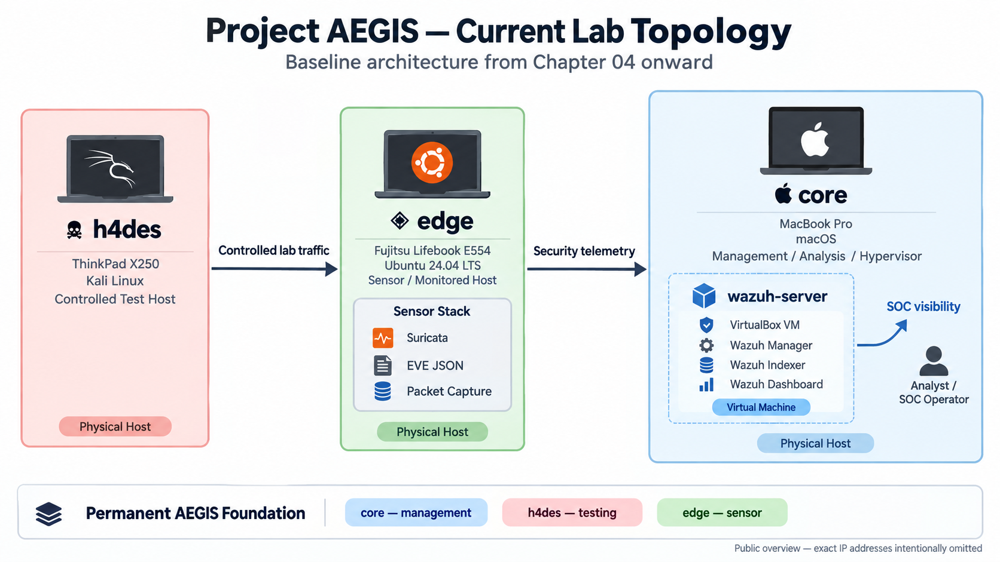

# Project AEGIS — Current Lab Architecture

This document defines the permanent lab architecture used by **Project AEGIS from Chapter 04 onward**.

The environment is intentionally built around three physical machines with clearly separated roles:

- testing and controlled attack simulation
- network and host telemetry collection
- centralized SIEM analysis and investigation

The goal is to keep the lab understandable, reproducible and stable while individual chapters add new tools, detections and scenarios.

---

## Current Topology



The architecture follows a simple defensive data flow:

**test activity → sensor visibility → centralized analysis**

---

## Physical Hosts

| Host | Hardware | Platform | Role |
|---|---|---|---|
| `⌘ core` | MacBook Pro | macOS | Management, analysis, documentation and virtualization |
| `☠ h4des` | ThinkPad X250 | Kali Linux | Controlled testing and traffic generation |
| `◈ edge` | Fujitsu Lifebook E554 | Ubuntu 24.04 LTS | Sensor and monitored host |

These three systems form the permanent physical foundation of AEGIS.

Their roles remain stable even when individual chapters introduce additional tools or detection methods.

---

## `⌘ core` — Management & SIEM Host

`core` is the administrative center of the lab.

It is used for:

- SSH administration
- evidence review
- packet analysis
- documentation
- Git and GitHub
- VirtualBox virtualization
- Wazuh Dashboard access

The central Wazuh environment runs on `core` as a VirtualBox VM named:

```text
Wazuh v4.14.4 OVA
```

The VM provides the central Wazuh Manager, Indexer and Dashboard for the AEGIS lab.
