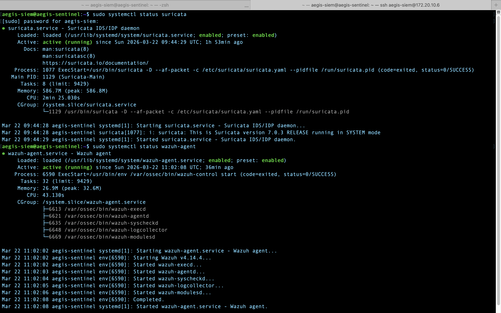
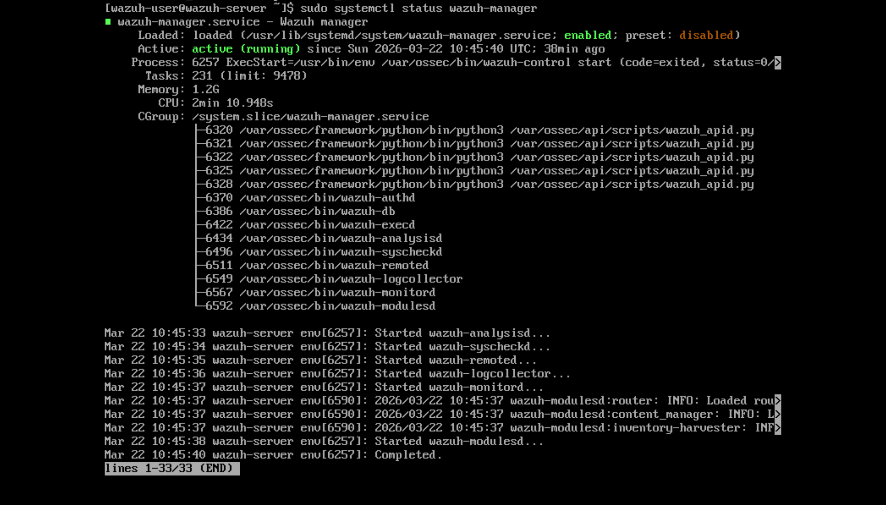
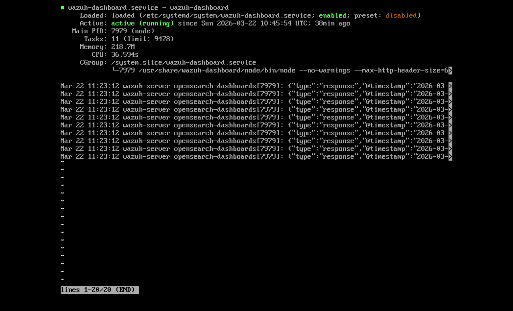
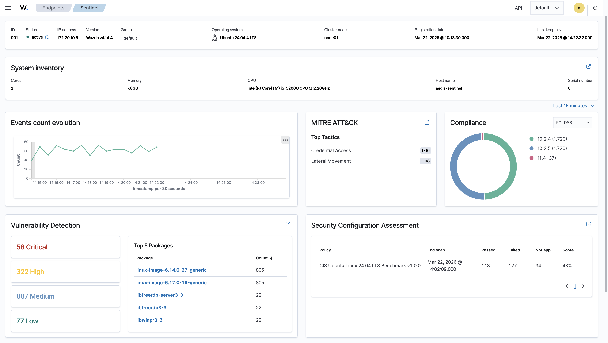

# 01 — Architecture

## Lab Environment

| Machine | OS | Role | IP |
|:--------|:---|:-----|:---|
| MacBook Pro (physical) | macOS | Management + Wazuh Server host | 172.20.10.4 |
| MacBook VirtualBox → Wazuh OVA | Ubuntu | SIEM Server — Wazuh Manager + Dashboard | 172.20.10.9 |
| Kali Laptop (physical) | Kali Linux | Attacker | 172.20.10.8 |
| Kali VirtualBox → aegis-sentinel | Ubuntu 24.04.4 LTS | Sensor Node — Suricata IDS + Wazuh Agent | 172.20.10.6 |

**Network:** Wireless Access Point · 172.20.10.0/28 · all machines on same subnet

---

## Architecture Diagram

```
Kali Laptop (physical) — Attacker
        │
        │  nmap / hydra (172.20.10.8)
        ▼
aegis-sentinel VM (172.20.10.6)
        │
        ├── Suricata IDS ──► /var/log/suricata/eve.json
        │
        └── Wazuh Agent ──► reads eve.json
                │
                │  port 1514/tcp
                ▼
        Wazuh Server (172.20.10.9)
        Wazuh Manager + Indexer + Dashboard
                │
                ▼
        MacBook Pro (172.20.10.4) → browser → https://172.20.10.9
        SOC visibility
```

---

## Service Status

### aegis-sentinel — Suricata IDS + Wazuh Agent

Both services confirmed active and enabled at boot.



```
suricata.service    — active (running) — Suricata 7.0.3 RELEASE — SYSTEM mode
wazuh-agent.service — active (running) — Wazuh v4.14.4
```

### Wazuh Server — Manager + Dashboard




```
wazuh-manager.service   — active (running) — memory: 1.2G
wazuh-dashboard.service — active (running) — memory: 218.7M — port 443
```

### Sentinel Agent — Connected to Wazuh Manager



```
Agent ID:   001
Agent name: Sentinel
IP:         172.20.10.6
OS:         Ubuntu 24.04.4 LTS
CPU:        Intel Core i5-5200U @ 2.20GHz
Memory:     7.8GB
Wazuh:      v4.14.4
Status:     active
```
