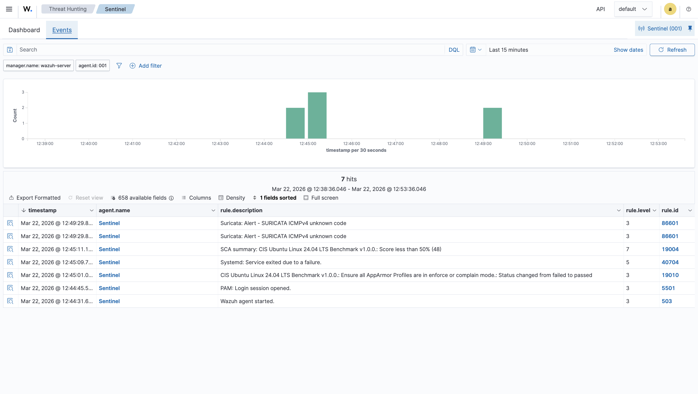
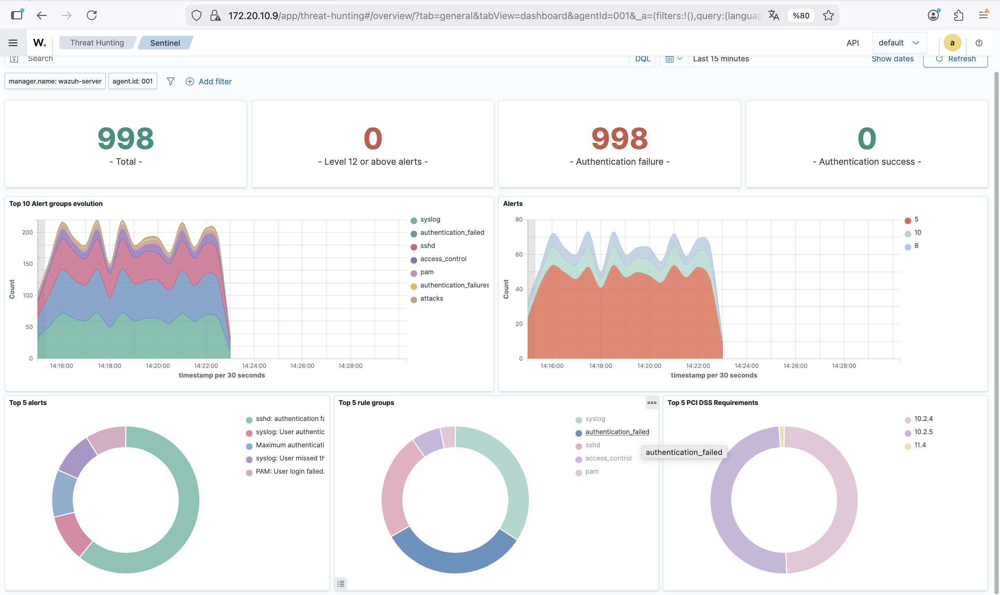
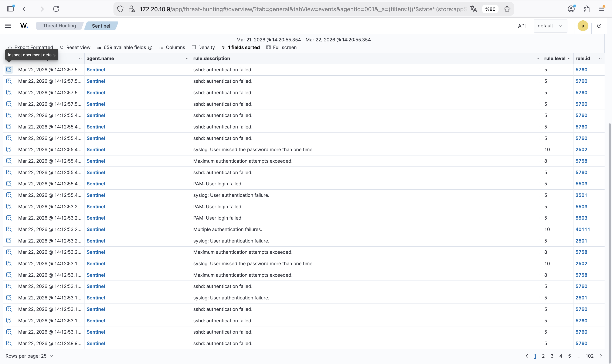
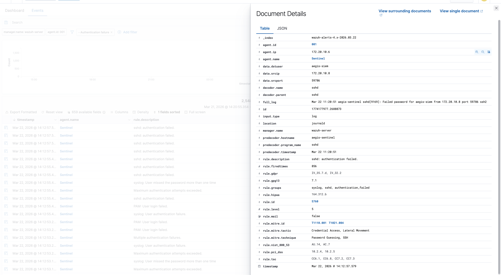
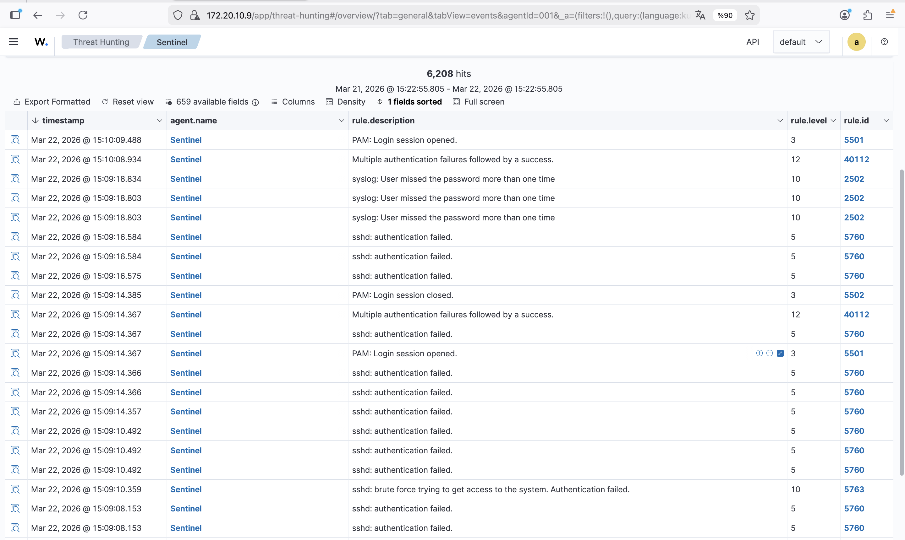
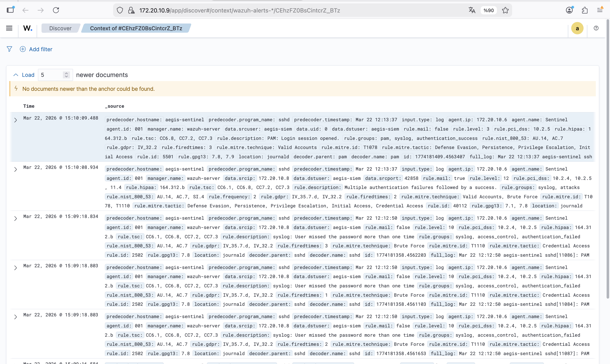
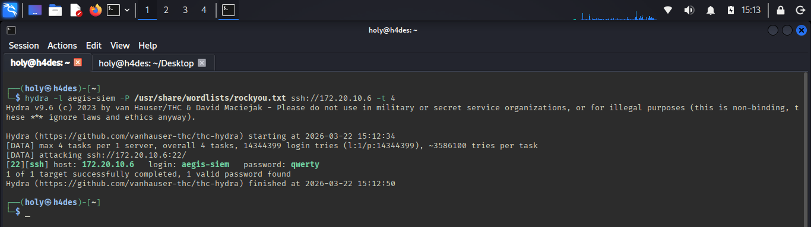
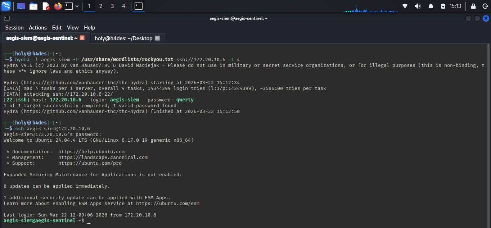

# 04 — Evidences

## Detection #1 — Network Reconnaissance (nmap)

Suricata detected anomalous ICMP probes generated by nmap's OS fingerprinting.



| Field | Value |
|:------|:------|
| `rule.description` | Suricata: Alert - SURICATA ICMPv4 unknown code |
| `rule.id` | 86601 |
| `rule.level` | 3 |
| `data.alert.signature_id` | 2200025 |
| `data.alert.category` | Generic Protocol Command Decode |
| `data.src_ip` | 172.20.10.4 (MacBook Pro) |
| `data.dest_ip` | 172.20.10.6 |
| `data.proto` | ICMP |
| `data.icmp_code` | 9 (non-standard — nmap OS probe) |
| `data.alert.action` | allowed (IDS mode) |

**MITRE ATT&CK:** T1595 — Active Scanning

---

## Detection #2 — SSH Brute Force

Wazuh detected the brute force pattern through rule escalation across multiple levels.

### Dashboard overview



```
998   Total alerts
998   Authentication failures
Top groups: authentication_failed, sshd, access_control, pam
```

### Events table



### Alert escalation pattern

| Level | Rule ID | Description |
|:------|:--------|:------------|
| 5 | 5760 | `sshd: authentication failed` — individual attempt |
| 8 | 5758 | `Maximum authentication attempts exceeded` |
| 10 | 2502 | `syslog: User missed the password more than one time` |
| 10 | 40111 | `Multiple authentication failures` |
| 10 | 5763 | `sshd: brute force trying to get access to the system` |

### Alert detail — MITRE ATT&CK mapping



| Field | Value |
|:------|:------|
| `data.srcip` | 172.20.10.8 (Kali) |
| `data.dstuser` | aegis-siem |
| `rule.firedtimes` | 856 |
| `rule.mitre.id` | T1110.001, T1021.004 |
| `rule.mitre.tactic` | Credential Access, Lateral Movement |
| `rule.mitre.technique` | Password Guessing, SSH |
| `rule.gdpr` | IV_35.7.d, IV_32.2 |
| `rule.pci_dss` | 10.2.4, 10.2.5 |
| `rule.hipaa` | 164.312.b |
| `rule.nist_800_53` | AU.14, AC.7 |

---

## Detection #3 — Initial Access (Brute Force → Success)

After password was found, Wazuh captured the successful authentication — the most critical alert of the chain.




| Field | Value |
|:------|:------|
| `rule.description` | Multiple authentication failures followed by a success |
| `rule.id` | 40112 |
| `rule.level` | **12** (critical) |
| `rule.mitre.id` | T1078, T1110 |
| `rule.mitre.tactic` | Defense Evasion, Persistence, Privilege Escalation, Initial Access |
| `rule.mitre.technique` | Valid Accounts, Brute Force |

### Hydra evidence




```
[22][ssh] host: 172.20.10.6   login: aegis-siem   password: qwerty
1 of 1 target successfully completed
```

---

## Full Kill Chain — Detection Summary

| Phase | Technique | ID | Detected | Rule Level |
|:------|:----------|:---|:---------|:-----------|
| Reconnaissance | Active Scanning | T1595 | ✅ Suricata ICMPv4 | 3 |
| Credential Access | Password Guessing | T1110.001 | ✅ rule 40111 | 10 |
| Lateral Movement | SSH | T1021.004 | ✅ rule 5760 | 5→10 |
| Initial Access | Valid Accounts | T1078 | ✅ rule 40112 | **12** |
