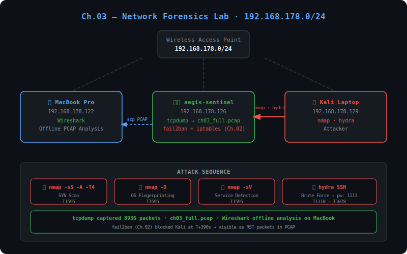

# 01 — Architecture

## Netzwerk Topologie



---

## Lab Umgebung

| Maschine | Rolle | OS | IP |
|:---------|:------|:---|:---|
| MacBook Pro | Wireshark Analyse | macOS | 192.168.178.122 |
| Kali Laptop | Angreifer | Kali Linux | 192.168.178.129 |
| aegis-sentinel VM | Capture Node | Ubuntu 24.04.4 LTS | 192.168.178.126 |

**Netzwerk:** Wireless Access Point · 192.168.178.0/24  
**Hinweis:** IP hat sich gegenüber Ch.01/02 geändert (vorher 172.20.10.0/28). Wazuh wird in diesem Chapter nicht benötigt.

---

## Capture Setup

`tcpdump` wurde auf aegis-sentinel gestartet **bevor** der Angriff begann:

```bash
sudo tcpdump -i enp0s3 -w /tmp/ch03_full.pcap
```

| Flag | Bedeutung |
|:-----|:----------|
| `-i enp0s3` | Interface auf dem gelauscht wird |
| `-w /tmp/ch03_full.pcap` | Pakete in Datei schreiben (für Offline-Analyse) |
| kein Filter | Alles aufnehmen — filtern später in Wireshark |

**Ergebnis:**
```
tcpdump: listening on enp0s3, link-type EN10MB
8936 packets captured
8945 packets received by filter
0 packets dropped by kernel
```

---

## PCAP Übertragung

Nach dem Angriff wurde die PCAP Datei per `scp` auf das MacBook übertragen:

```bash
scp aegis-siem@192.168.178.126:/tmp/ch03_full.pcap ~/Desktop/ch03_full.pcap
```

Wireshark öffnet die Datei lokal auf dem MacBook zur forensischen Analyse.

---

*homelab_AEGIS · github.com/cyb-ersin · Ch.03 — Network Forensics & PCAP Analysis*
