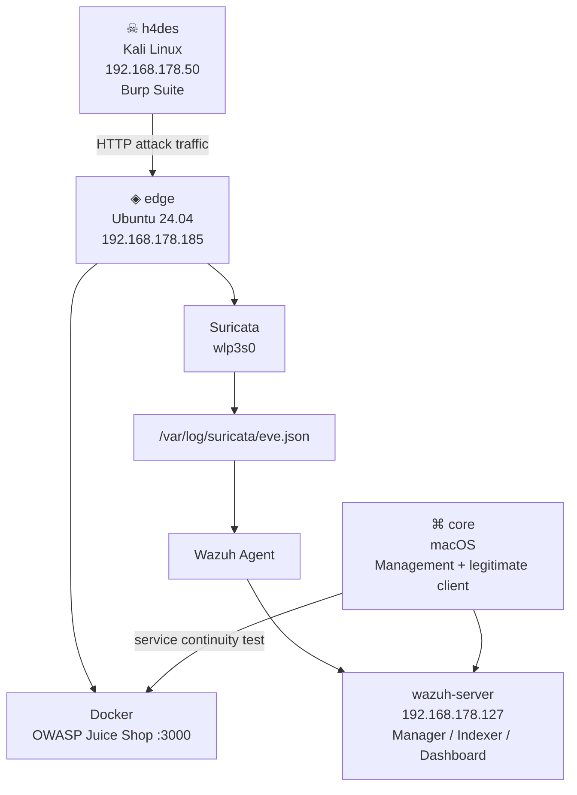

# 01 — Architecture

## Network Topology



---

## Lab Environment

| Machine | Role | Platform | IP |
|:--------|:-----|:---------|:---|
| `☠ h4des` | Pentest / controlled attack | Kali Linux | `192.168.178.50` |
| `◈ edge` | Target + sensor | Ubuntu 24.04 LTS | `192.168.178.185` |
| `wazuh-server` | Central SIEM | Wazuh VM on VirtualBox | `192.168.178.127` |
| `⌘ core` | Management / dashboard / legitimate client | macOS | DHCP |

**Network:** 192.168.178.0/24

---

## Data Flow

```text
Burp request
   ↓
Juice Shop :3000
   ↓
Suricata on edge
   ↓
eve.json
   ↓
Wazuh Agent
   ↓
Wazuh Manager / Dashboard
```

This chapter therefore uses the same traffic twice:

- offensively, to prove the web vulnerability
- defensively, to validate visibility, detection and response

---

*homelab_AEGIS · github.com/cyb-ersin · Ch.04 — Web Application Attack, Detection & Incident Response*
