# 04 — Evidences

## EV-01 — Invalid Login Baseline

**Tool:** Burp Suite Repeater
**Result:** `HTTP/1.1 401 Unauthorized`

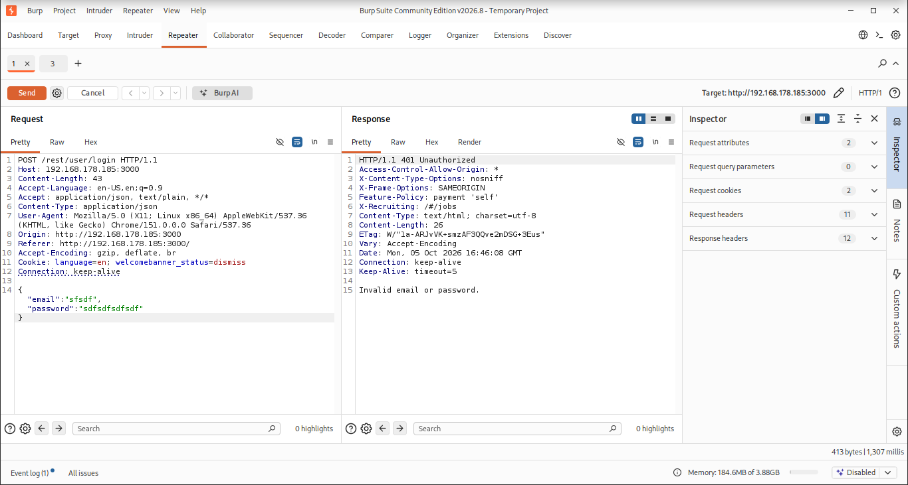

The normal invalid login failed as expected. This is the baseline against which the later bypass is compared.

---

## EV-02 — SQL Injection Authentication Bypass

**Tool:** Burp Suite Repeater
**Payload:** `admin@juice-sh.op'--`
**Result:** `HTTP/1.1 200 OK`

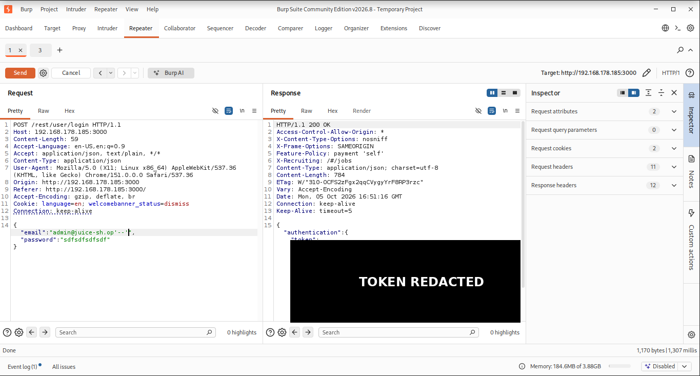

The same login endpoint returned HTTP 200 after the SQLi payload. The authentication token is blacked out in the public evidence image.

---

## EV-03 — Administrative Impact

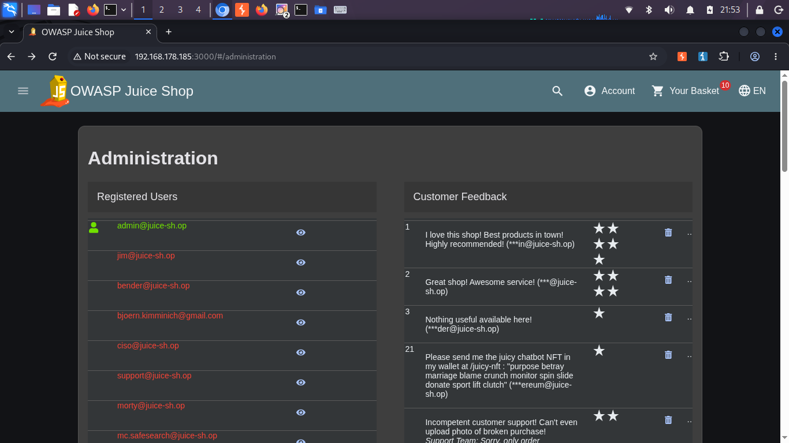

The resulting session could access the Juice Shop Administration page. This confirms impact beyond a status-code change.

---

## EV-04 — Custom Suricata Rule

**File:** `/var/lib/suricata/rules/local.rules`

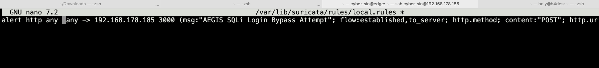

The final rule accepts traffic from any source but remains specific to the Juice Shop destination, login endpoint and tested SQLi payload.

---

## EV-05 — Custom Alert in `eve.json`

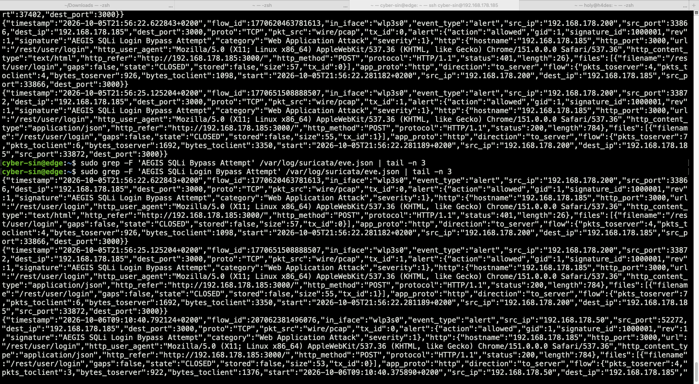

The latest event shows the final post-reboot test:

```text
src_ip: 192.168.178.50
dest_ip: 192.168.178.185
dest_port: 3000
signature_id: 1000001
signature: AEGIS SQLi Login Bypass Attempt
http_method: POST
status: 200
```

The `200` response confirms that the rule matched the successful bypass transaction.

---

## EV-06 — Wazuh Alert Overview

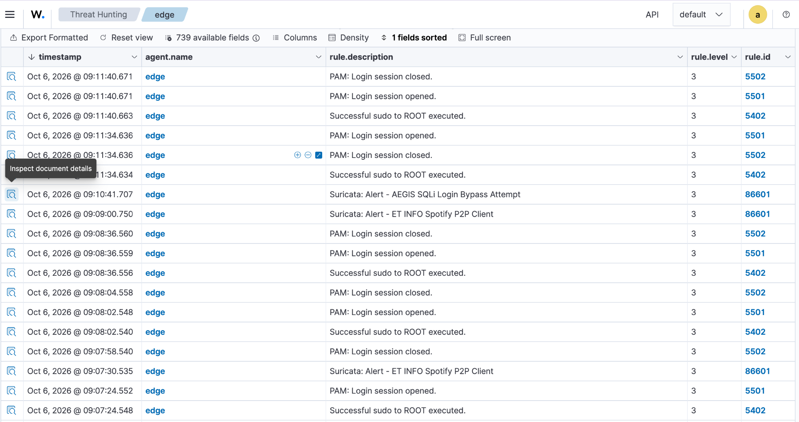

Wazuh received the custom Suricata alert centrally:

```text
Suricata: Alert - AEGIS SQLi Login Bypass Attempt
rule.id: 86601
```

---

## EV-07 — Wazuh Signature Details

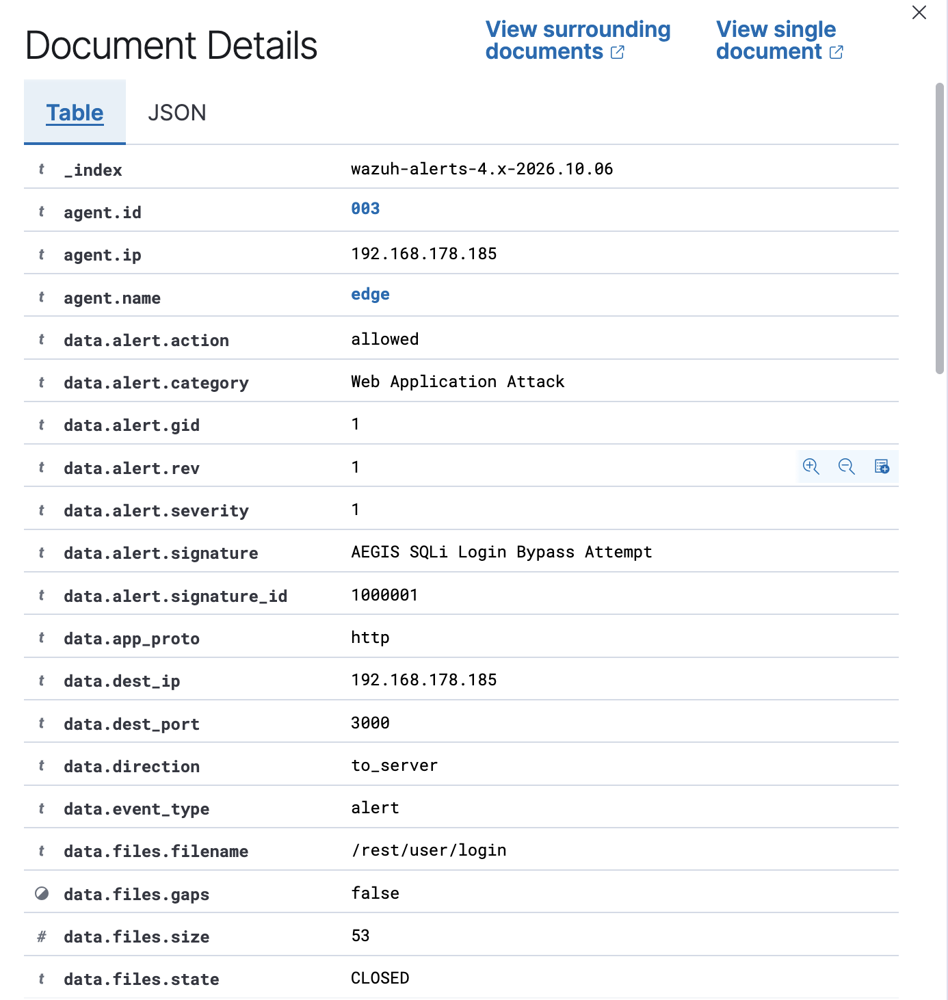

Key parsed fields:

```text
agent.name: edge
data.alert.category: Web Application Attack
data.alert.severity: 1
data.alert.signature: AEGIS SQLi Login Bypass Attempt
data.alert.signature_id: 1000001
data.dest_ip: 192.168.178.185
data.dest_port: 3000
```

---

## EV-08 — Wazuh HTTP + Rule Details

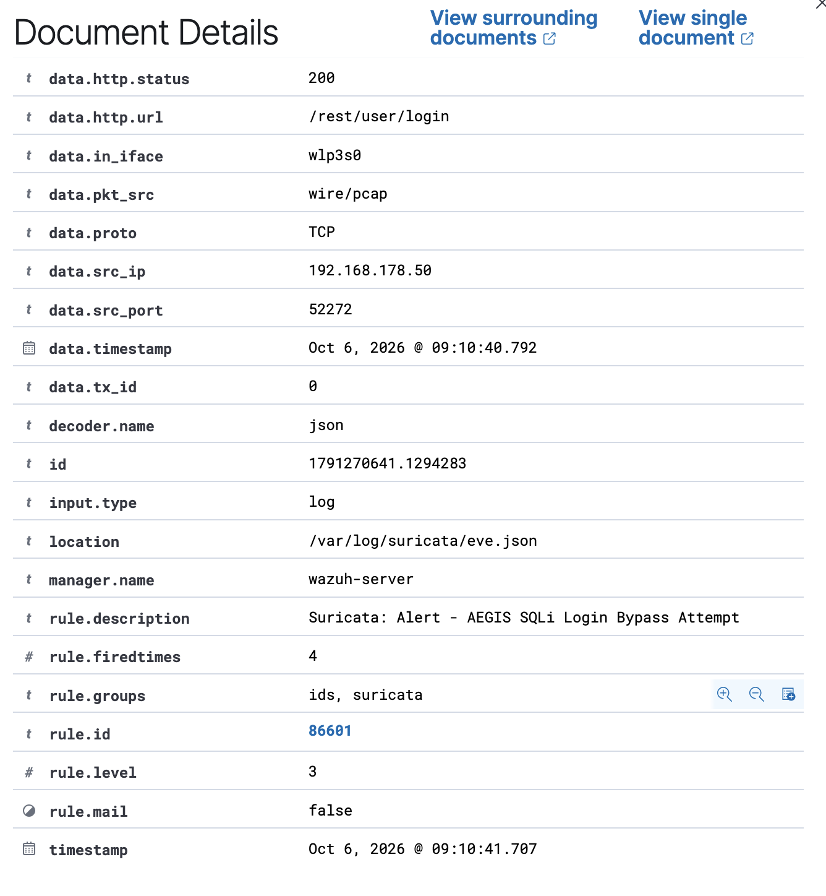

This view correlates:

```text
POST /rest/user/login
HTTP status: 200
rule.description: Suricata: Alert - AEGIS SQLi Login Bypass Attempt
rule.id: 86601
location: /var/log/suricata/eve.json
```

This is the final centralized evidence that the successful attack transaction was detected.

---

## EV-09 — Containment Rule

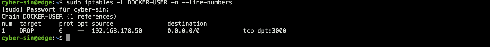

The attacking host was blocked only for TCP/3000:

```text
DROP tcp -- 192.168.178.50  0.0.0.0/0  tcp dpt:3000
```

---

## EV-10 — Attacker Blocked

**Machine:** `h4des`

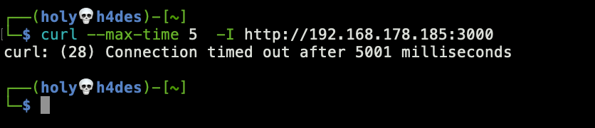

```text
curl: (28) Connection timed out after 5001 milliseconds
```

The containment rule prevented Kali from reaching Juice Shop.

---

## EV-11 — Legitimate Client Still Reaches Service

**Machine:** `core`

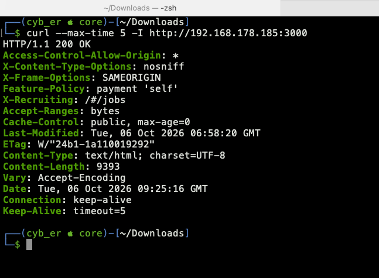

```text
HTTP/1.1 200 OK
```

The service remained available to a legitimate client while the current malicious source was contained.

---

*homelab_AEGIS · github.com/cyb-ersin · Ch.04 — Web Application Attack, Detection & Incident Response*
